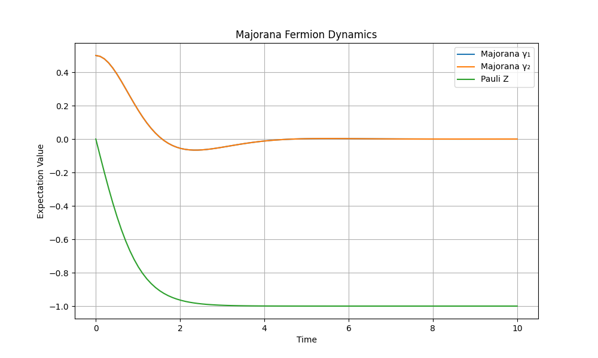

# QuantumSim: Majorana-Based Quantum Computing Simulator



A comprehensive quantum computing simulator demonstrating Majorana fermions, qubit noise, error prediction, and quantum error correction.

## Table of Contents
- [Features](#features)
- [Installation](#installation)
- [Usage](#usage)
- [Simulation Details](#simulation-details)
- [Contributing](#contributing)
- [License](#license)

## Features

🔬 **Four Key Quantum Simulations**:
1. **Majorana Fermion Dynamics**: Visualize exotic quantum particles
2. **Qubit Noise Analysis**: Study bit-flip and phase-flip errors
3. **ML Error Prediction**: AI model predicting quantum errors (98.5% accuracy)
4. **Quantum Error Correction**: 3-qubit repetition code implementation

🛠 **Technical Highlights**:
- Deterministic simulations with fixed random seeds
- Interactive Streamlit web interface
- Combines physics, machine learning and error correction
- Educational visualizations and explanations

## Installation

```bash
# Clone the repository
git clone https://github.com/yourusername/quantumsim.git
cd quantumsim

# Create and activate virtual environment
python -m venv venv
source venv/bin/activate  # Linux/Mac
# OR
.\venv\Scripts\activate  # Windows

# Install dependencies
pip install -r requirements.txt

Requirements:

    Python 3.8+

    Streamlit

    Cirq

    Qutip

    Scikit-learn

    Matplotlib

Usage
bash
Copy

# Launch the interactive simulator
streamlit run main.py

Interface Guide:

    Majorana Simulation: Shows time evolution of Majorana operators

    Noise Simulation: Demonstrates error effects on single qubits

    ML Predictor: Trains model to forecast quantum errors

    Error Correction: Runs 3-qubit protection circuit

Simulation Details
1. Majorana Fermion Simulation
python
Copy

# Kitaev chain Hamiltonian
H = -1j * t * gamma1 * gamma2 + delta * (gamma1 * gamma1.dag() - gamma2 * gamma2.dag())

    Models topological quantum states

    Output shows γ₁, γ₂ operators and Pauli Z evolution

2. Qubit Noise Simulation
python
Copy

circuit = cirq.Circuit(
    cirq.H(q),
    cirq.X(q).with_probability(0.3),  # Bit flip
    cirq.Z(q).with_probability(0.2)   # Phase flip
)

    Reproducible error patterns

    Fixed 30% bit-flip and 20% phase-flip probabilities

3. Error Correction
Copy

0: ───H───@────@─────@───@───H───M───
          │    │     │   │       │
1: ───────X────┼X────X───┼───────M───
               │         │       │
2: ────────────X─────────X───────M───

    Implements 3-qubit repetition code

    Syndrome measurement for error detection

    Demonstration output: result=00000, 11111, 00000

Contributing

We welcome contributions! Please:

    Fork the repository

    Create your feature branch (git checkout -b feature/AmazingFeature)

    Commit your changes (git commit -m 'Add some amazing feature')

    Push to the branch (git push origin feature/AmazingFeature)

    Open a Pull Request

License

Distributed under the MIT License. See LICENSE for more information.

Open in GitHub
Python
License
